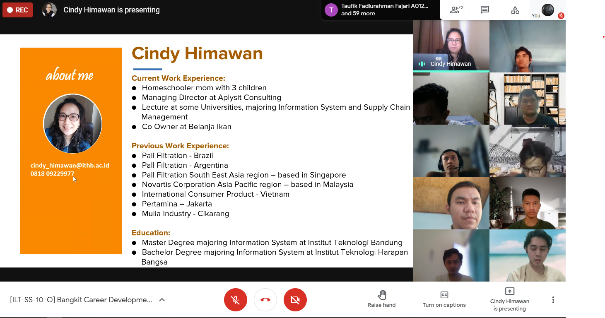
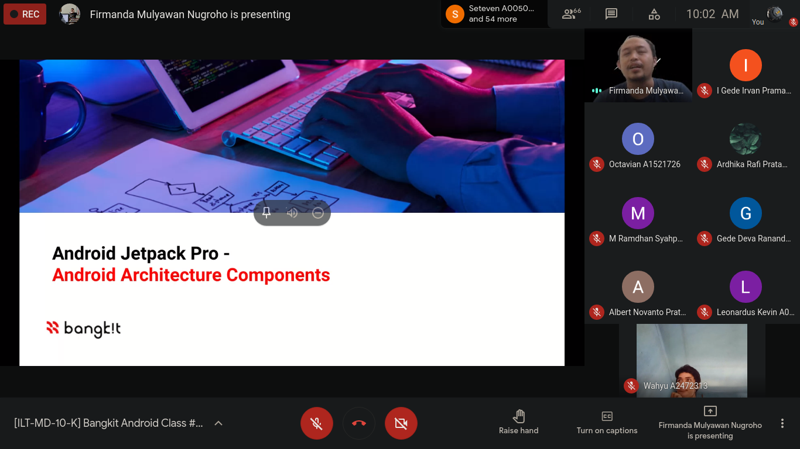

## 19 ~ (25 Sunday) April
* * *

## Overview
Everyone busy with self study, CAPSTONE, private life. And this week we must completed the idea / title for our project.
  

23 April
---
- Attending #10 **Guest Speaker Session**
    1. Speakers: Peggy Putri
    1. Title: "Solution Based Communications part 1"
    1. Platform: Youtube

24 April
---
- Attending #10 **Soft Skill Class**
    1. Instructor: Cindy Himawan
    1. Topic: "Business Finance"
- Attending #11 **Guest Speaker Session**
    1. Speakers: Rama Dhonanto
    1. Title: "Take control of yourself #2"
    1. Platform: Youtube
- Attending #12 **Guest Speaker Session**
    1. Speakers: Wirawan Winarto, Michaela Nathania
    1. Title: "Working at tech startups vs established tech giants"
    1. Platform: Youtube

Moment: 

25 April
---
- Attending #10 **Tech Skill Class**
    1. Instructor: Firmanda Mulyawan Nugroho
    1. Topic: "Android Architecture Component"

Moment:

* * *
[🔙 Back](./../)
