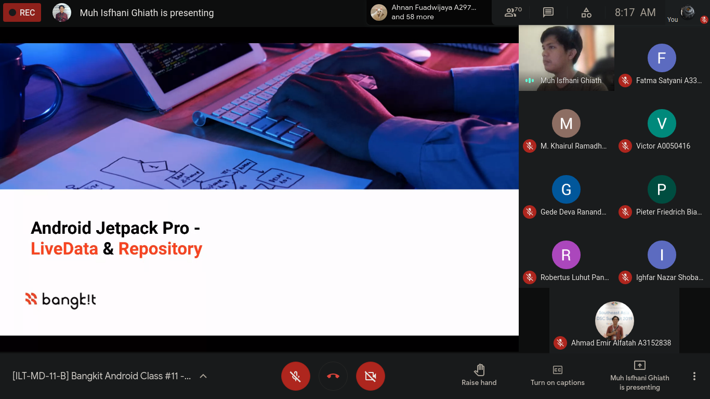
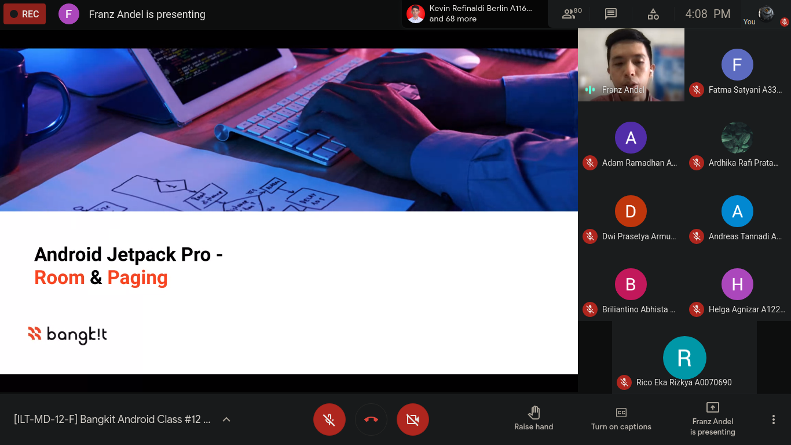
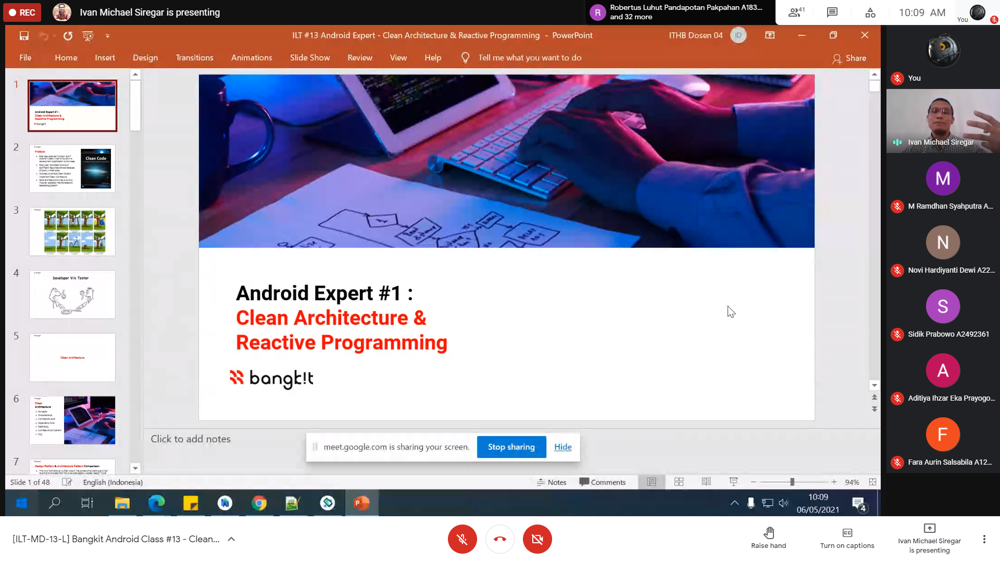

## 3 ~ 9 May
* * *

3 May
---
- Attending #11 **Tech Skill Class**
    1. Instructor: Muh Isfhani Ghiath
    1. Topic: "LiveData & Repository"
- Attending #12 **Tech Skill Class**
    1. Instructor: Franz Andel
    1. Topic: "Room Database on Android & Paging"

Moment:

6 May
---
- Attending #13 **Tech Skill Class**
    1. Instructor: Ivan Michael Siregar
    1. Topic: "Clean Architecture & Android Reactive Programming"

Moment: 

7 May
---
- Attending #12 **Soft Skill Class**
    1. Instructor: Krisna Parahita
    1. Topic: "Critical Thinking"

8 May
---
- Attending #13 **Soft Skill Class**
    1. Instructor: Zanuar
    1. Topic: "Idea Generation and MVP Planning"

9 May
---
- Attending #14 **Soft Skill Class**
    1. Instructor: Adhi Duta Baskara
    1. Topic: "Persuasive Leader 3"

* * *
[🔙 Back](./../)
