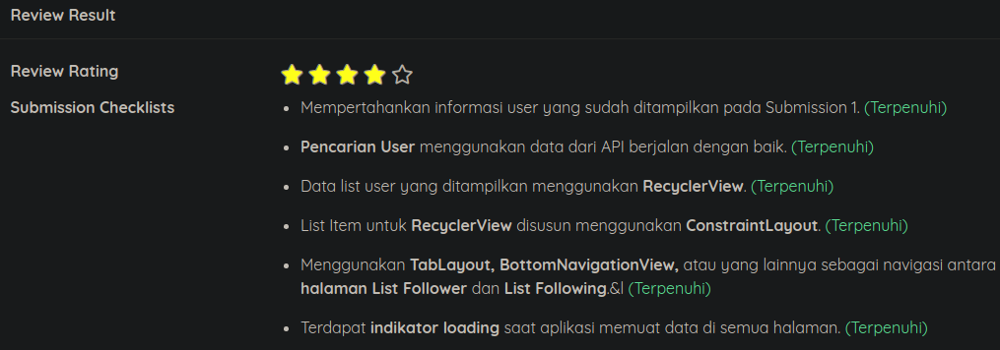
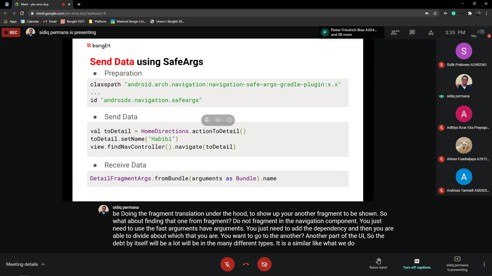

## 22 ~ 27 March
* * *

22 March
---
Happening:

- Attending #5 **Guest Speaker Session**
    1. Speakers: Amelia Hendra, Priscilla Anais
    1. Title: "Leading digital teams while achieving work-life balance"
    1. Series: IWD (International Women's Day) at Bangkit 2021
    1. Platform: Youtube

23 March
---
Happening:
- Submit BFAA Submission #2 Application, got 4 Stars from Dicoding Reviewer.

Details: 
```
Just got **Accepted** after 2 Fail, but knowledge transfer is there.
Learn new things or reminded what I forgot to implement.

Keep study!
```


24 March
---
Happening:

- Attending #6 **Guest Speaker Session**
    1. Speakers: Veni Johanna
    1. Title: "Fireside chat with ..."
    1. Series: IWD (International Women's Day) at Bangkit 2021
    1. Platform: Youtube


25 March
---
Happening:

- Attending #7 **Guest Speaker Session**
    1. Speakers: Nicole Le 
    1. Title: "Fireside chat with ..."
    1. Series: IWD (International Women's Day) at Bangkit 2021
    1. Platform: Youtube
- Attending #8 **Guest Speaker Session**
    1. Speakers: Natalia Tsarkova
    1. Title: "The journey to be a Tech-entrepreneur woman."
    1. Series: IWD (International Women's Day) at Bangkit 2021
    1. Platform: Youtube


27 March
---
- Attending #6 **Tech Class**
    1. Instructor: Sidiq Permana
    1. Topic: "Fundamental: UI UX"

Detail: Get new Insight for UI UX mobile development from Android Expert itself.

Moment:



* * *
[🔙 Back](./../)