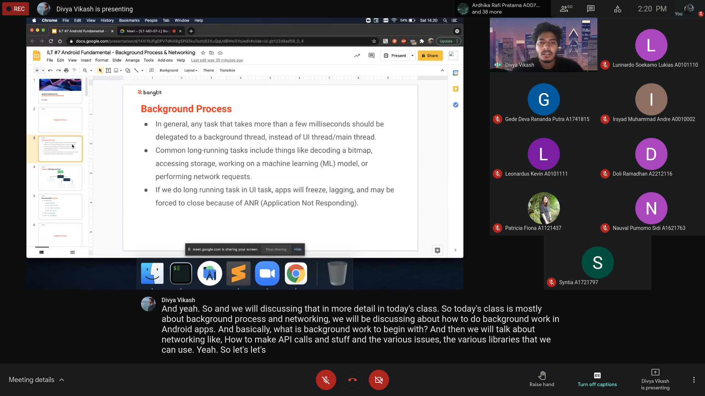

## 29 March ~ 3 April
* * *

3 April
---
- Attending #7 **Tech Class Class**
    1. Instructor: Divya Vikash
    1. Topic: "Fundamental: Background Process and Network"

Detail: Learn bacgkround process (Executors, Kotlin Coroutines), and Networking request / process in application.

Moment:

* * *
[🔙 Back](./../)