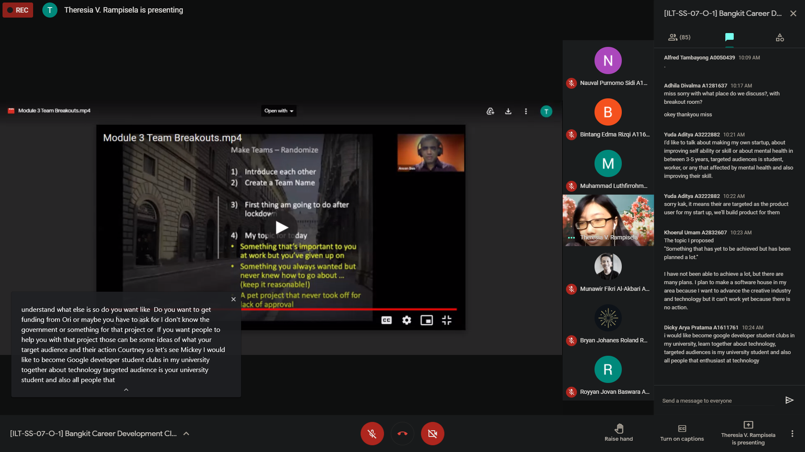
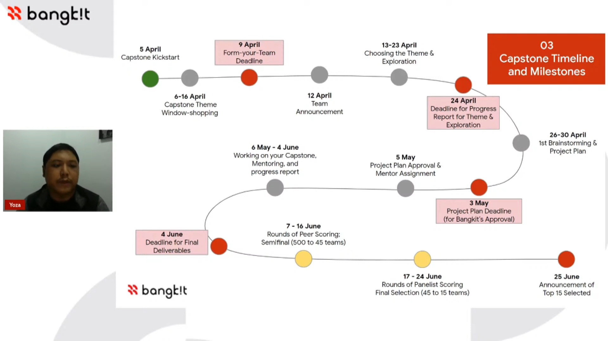
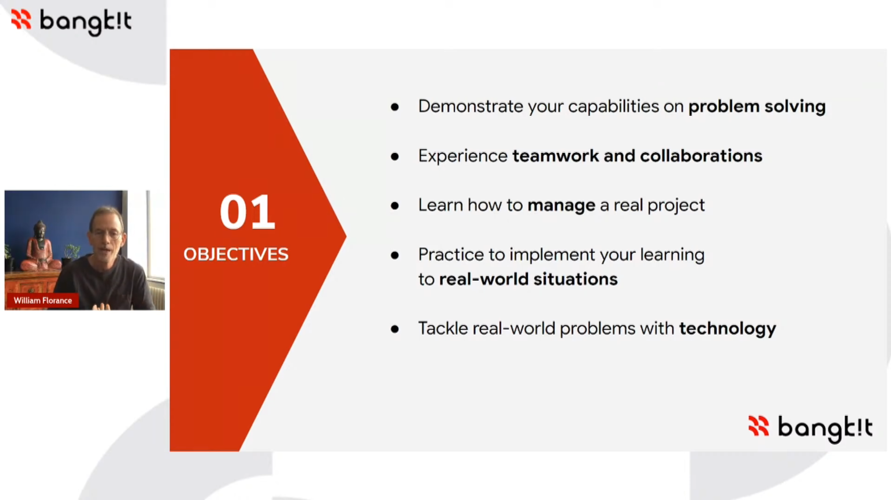
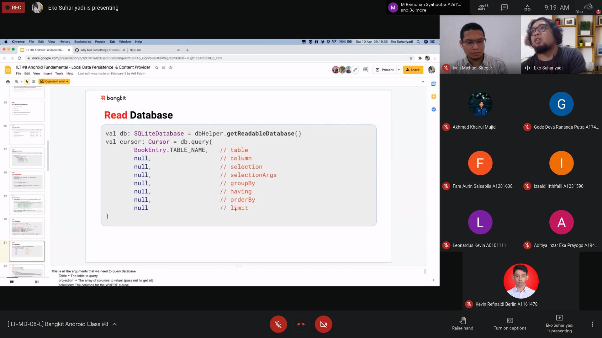

## 5 ~ 10 April
* * *

## Overview
**CAPSTONE** is STARTED, Capstone is Project Based for Bangkit Participants to getting knowledge from real problems. Solve problems that Indonesia have, and with other teammates from other path. We collaborate to solve and with a Mentor that appointed by Bangkit itself to drive our Project.
  

5 April
---
- Attending #7 part 1 **Soft Skill Class**
    1. Instructor: Theresia Veronika Rampisela
    1. Topic: "Persuasive Leader 1"
- Attending **CAPSTONE** Project Briefing
    1. Platform: [Youtube](https://www.youtube.com/watch?v=B7i_GAIbC5A)

Moment: 
- Soft Skill Class

- CAPSTONE

6 ~ 7 April
---
- Attending **CAPSTONE** Theme Presentation #1 | [Link](https://www.youtube.com/watch?v=82QpqGmJFcg)
- Attending **CAPSTONE** Theme Presentation #2 | [Link](https://www.youtube.com/watch?v=V2SfdNhO-Tg)
- Attending **CAPSTONE** Theme Presentation #3 | [Link](https://www.youtube.com/watch?v=zk24FOTi4hw)

Detail: Many Topics for **E-Government** shared by JSC (Jakarta Smart City), that give me opportunity to use it for other competitions, like KMIPN.

10 April
---
- Attending #8 **Tech Skill Class**
    1. Instructor: Ivan Michael Siregar, Eko Suhariyadi
    1. Topic: "Fundamental: Local Storage and Shared Preferences"

Detail: Learn many things and implementation about shared pref and Local Storage SQLite.

Moment: 

* * *
[🔙 Back](./../)