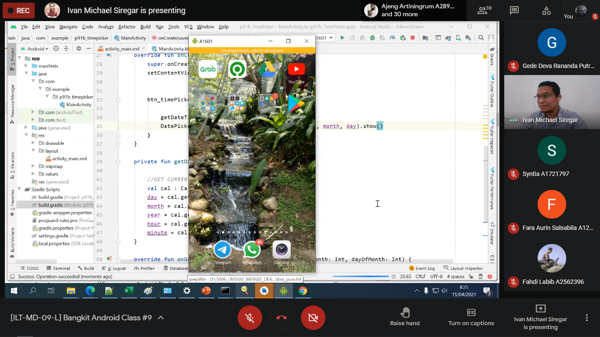
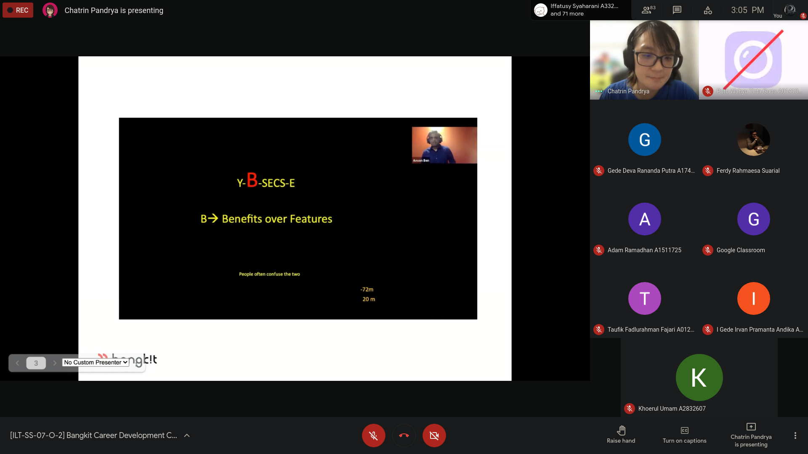

## 12 ~ 17 April
* * *

## Overview
Busy week, after the shock of **CAPSTONE**. Some student just doesn't feel to Learn again, but have to done on time.
  

12 ~ 13 April
---
- Attending **CAPSTONE** Theme Presentation #4 | [Link](https://www.youtube.com/watch?v=bViUrTFD3fI)
- Attending **CAPSTONE** Theme Presentation #5 | [Link](https://www.youtube.com/watch?v=mUFr4w9WDgA)

15 April
---
- Attending #9 **Tech Skill Class**
    1. Instructor: Ivan Michael Siregar
    1. Topic: "Fundamental: Reminder Notifications"
- Attending **CAPSTONE** Theme Presentation #6 | [Link](https://www.youtube.com/watch?v=Mep_9LZ1tZg)
- Finished **Self-Study** with title "Belajar Fundamental Aplikasi Android" from Dicoding

Detail: 
- Learn to use pending intent on Notification, single alarm, repeating alarm.
- [BFAA Certificate](https://www.dicoding.com/certificates/1OP8DV71VPQK)

Moment: 

16 April
---
- Attending #7 part 2 **Soft Skill Class**
    1. Instructor: Chatrin Pandrya
    1. Topic: "Persuasive Leader 2"

Moment: 

17 April
---
- Attending #9 **Guest Speaker Session**
    1. Speakers: Rama Dhonanto
    1. Title: "Knowing yourself #1"
    1. Platform: Youtube

* * *
[🔙 Back](./../)